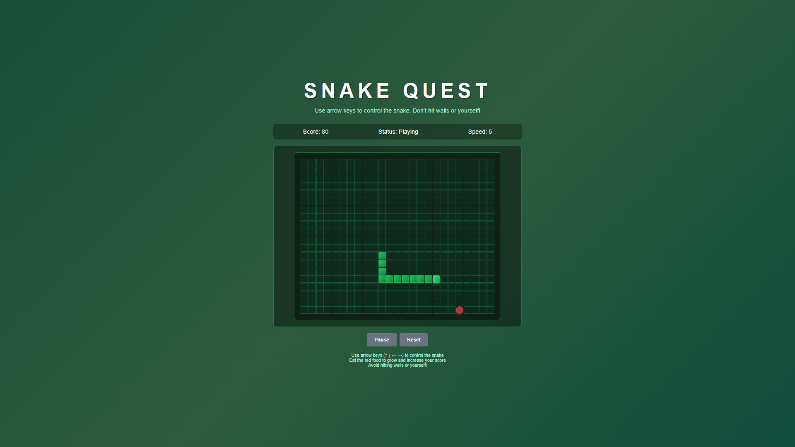

# Snake Game

A modern, clean, and fully functional implementation of the classic **Snake Game** using **HTML**, **CSS**, and **JavaScript**.  
Built with responsive design and a beautiful UI, playable on both desktop and mobile browsers.

---

## Features

- Classic Snake Gameplay
- Food Generation
- Increasing Speed as You Progress
- Play Again & Reset Functionality
- Pause & Resume Support
- Win Condition for Full Grid Fill
- Smooth Animations & Modern UI

---

## 📸 Preview

 <!-- Replace with your actual screenshot or remove this section if not needed -->

---

## How It Works

- The game uses a 20x20 grid to render the snake and food.
- Arrow keys or WASD are used for controlling the snake.
- Eating food increases the snake length and score.
- Colliding with the wall or the snake's own body ends the game.
- Speed increases as the snake grows, adding to the challenge.

---

## Tech Stack

- **HTML5** – Game layout and UI
- **CSS3** – Styling, grid layout, and animations
- **JavaScript (ES6)** – Game logic and interaction

---

## Controls

| Action     | Keys        |
|------------|-------------|
| Move Up    | Arrow ↑ / W |
| Move Down  | Arrow ↓ / S |
| Move Left  | Arrow ← / A |
| Move Right | Arrow → / D |
| Start / Restart | `Start` / `Reset` Button |
| Pause      | `Pause` Button |
| Play Again | `Play Again` Button after Game Over |

---

